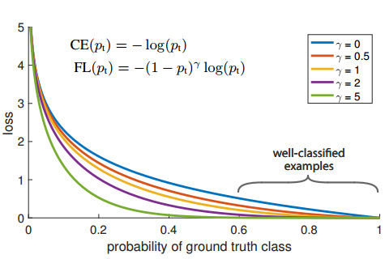

# pytorch-multi-class-focal-loss

An implementation of multi-class focal loss in pytorch. 

Focal loss,originally developed for handling extreme foreground-background class imbalance in object detection algorithms, could be used as an alternative for cross-entropy loss when you have imbalanced datasets.
 original paper: https://arxiv.org/abs/1708.02002
 

